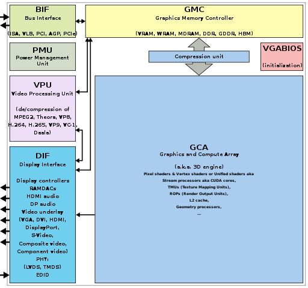
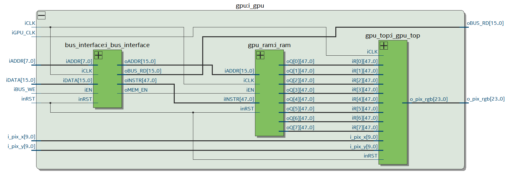

# Simple-GPU

## About

This is a simplified version of a graphics card and a processor communicating in order to achive an assembly program drawing rectangles on a monitor via HDMI on an Intel MAX1000 board with a HDMI shield.

This GPU is modeled based on the generic block diagram from Wikipedia[^1].  

The steps the GPU takes once it starts receiving the instruction:
1. Bus interface receives the instruction in parts from CPU and assembles it
2. Once the `end` signal is receieved, GPU RAM writing is enabled and the instruction is sent from bus interface to GPU RAM
3. GPU RAM receives the instruction, decodes the address and saves the instruction to the selected register
4. GPU draws everything stored in its memory repeatedly

## How to use it

Sending data from data ram to gpu ram using st instruction (`data`, `address`):
1. (_anything_, `0x300`)
2. (instruction, `0x301`...`0x305`)
3. (_anything_, `0x306`)

The instruction is formatted like `OO` `CCCCCC` `XXXXXXXXXX` `YYYYYYYYYY` `XXXXXXXXXX` `YYYYYYYYYY` where O is an operation (currently unused), C is color `RRGGBB`, and X and Y are x1, y1, x2 and y2 respectively.

Data is read in order:
1. 6 bit color (rrggbb bits for red, green and blue)
2. 10 bit x1
3. 10 bit y1
4. 10 bit x2
5. 10 bit y2

where (x1, y1) is the top left corner of the rectangle and (x2, y2) is the bottom right corner.

One example of sending a rectangle from data ram (starting address `0x00000005`) to gpu ram (register at address `0x000`)
```asm
sub R0, R0, R0
inc R0, R0
shl R0, R0
shl R0, R0
inc R0, R0      ;; R0 = 5

sub R1, R1, R1
add R1, R1, R6  ;; R1 = 0x300

st  R0, R1      ;; addr = 00000000 (start)

ld  R3, R0      ;; R3 = color
inc R1, R1
st  R3, R1      ;; addr = 00000001 (color)

inc R0, R0
ld  R3, R0      ;; R3 = x1
inc R1, R1
st  R3, R1      ;; addr = 00000010 (x1)

inc R0, R0
ld  R3, R0      ;; R3 = y1
inc R1, R1
st  R3, R1      ;; addr = 00000011 (y1)

inc R0, R0
ld  R3, R0      ;; R3 = x2
inc R1, R1
st  R3, R1      ;; addr = 00000100 (x2)

inc R0, R0
ld  R3, R0      ;; R3 = y2
inc R1, R1
st  R3, R1      ;; addr = 00000101 (y2)

sub R0, R0, R0  ;; Address at which to store the rectangle
inc R1, R1
st  R0, R1      ;; addr = 00000110 (end)
```

[^1]: [Graphics Processing Unit](https://en.wikipedia.org/wiki/Graphics_processing_unit)
